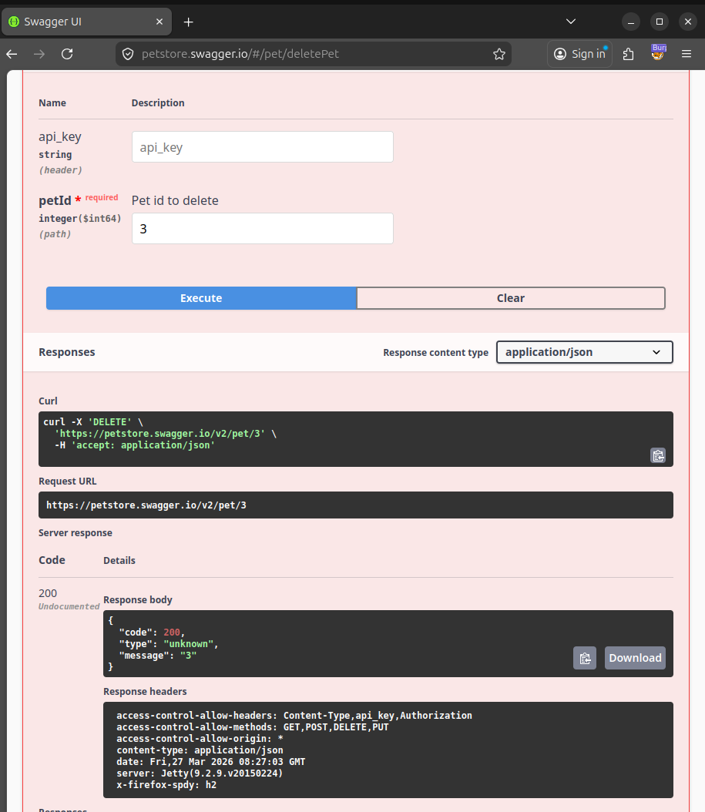
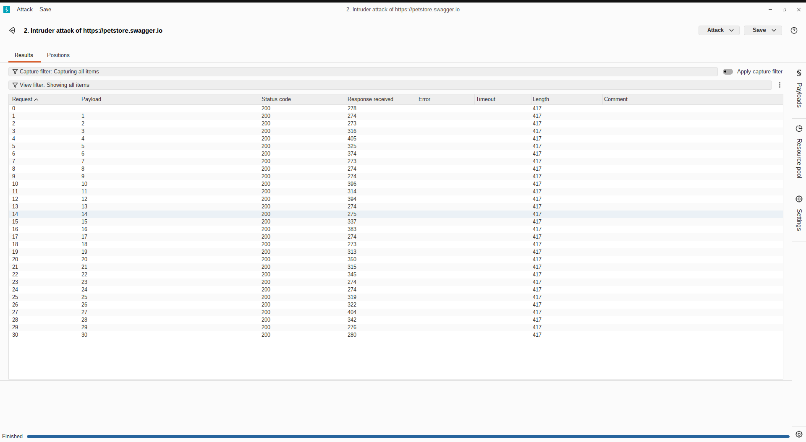
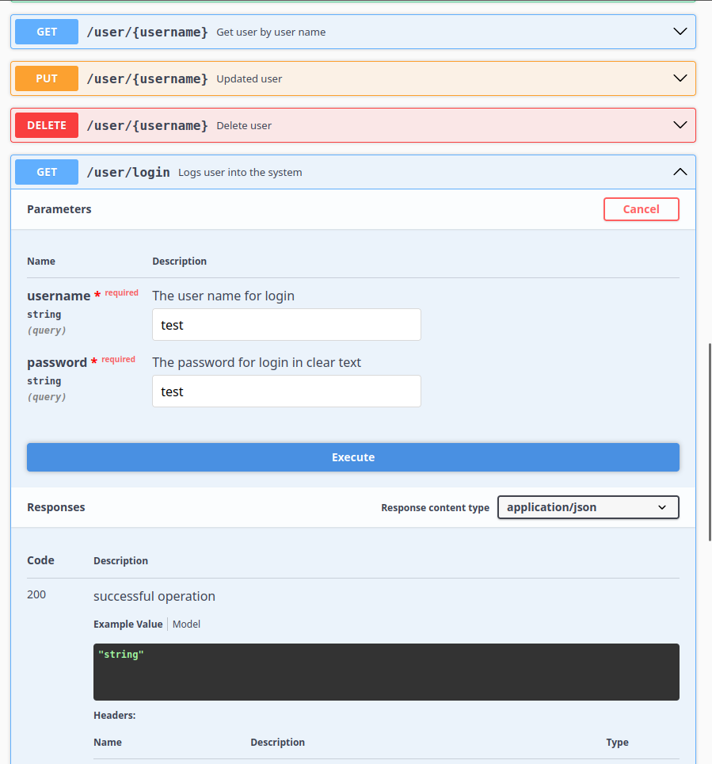
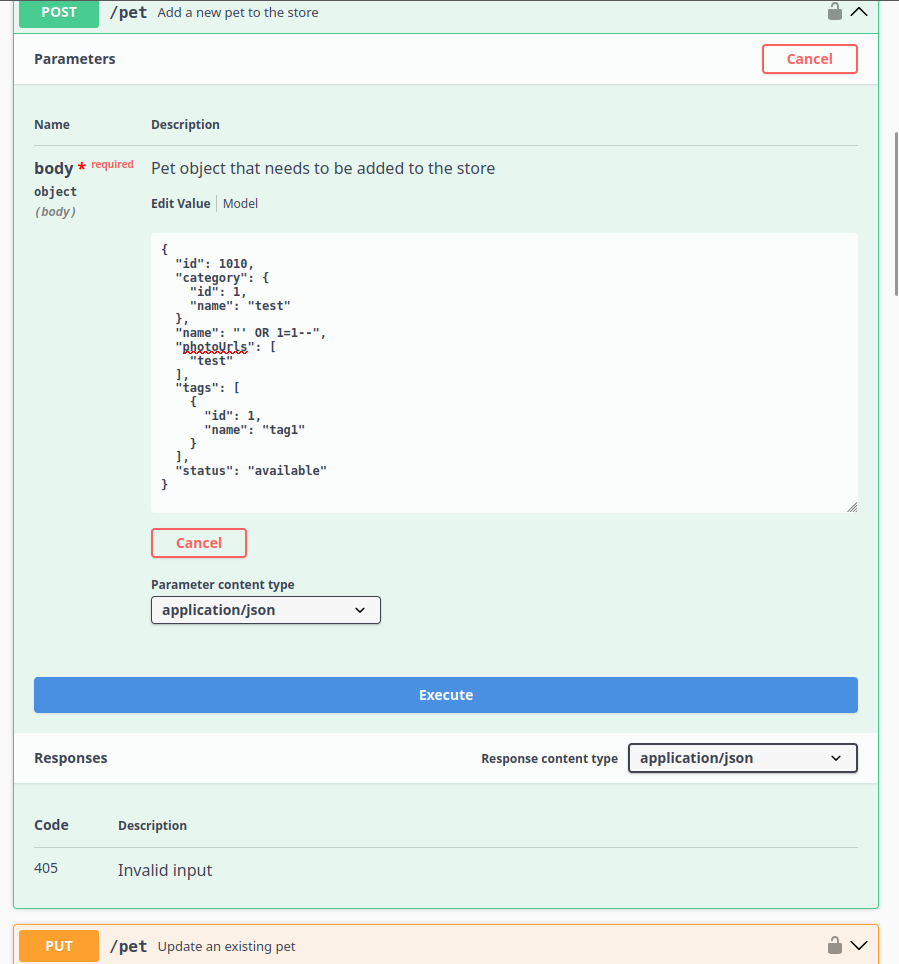
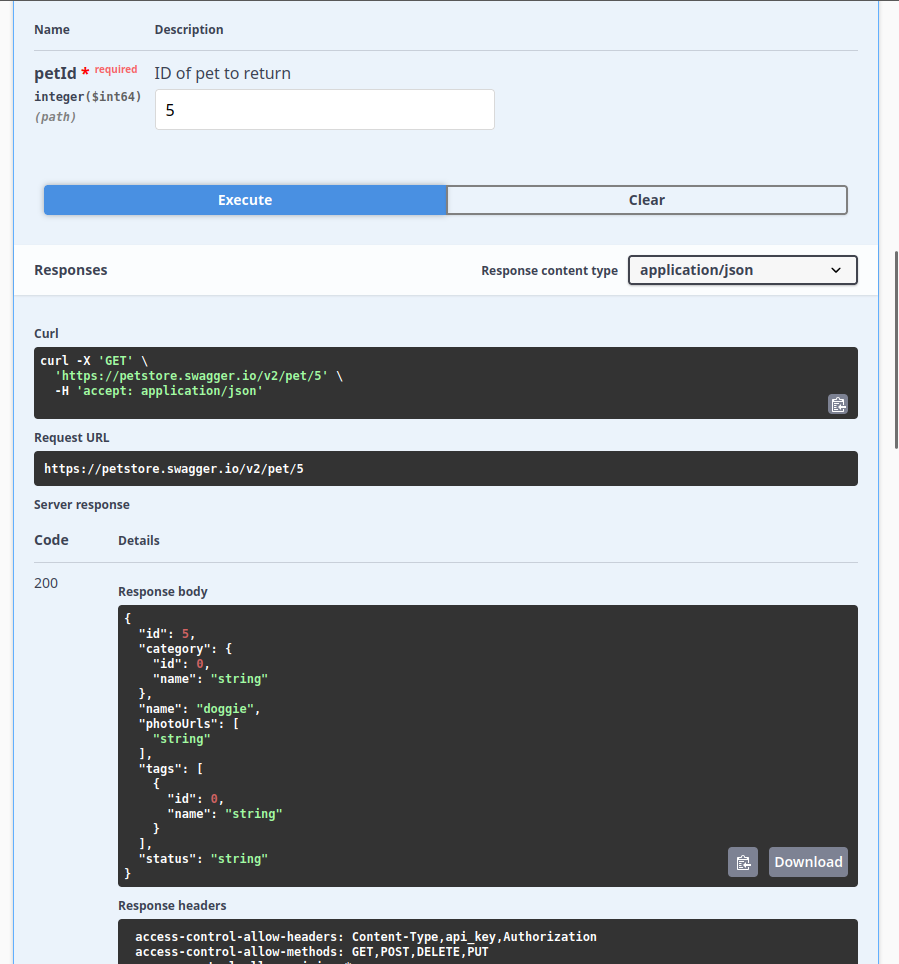

#  VAPT Report – Swagger Petstore API

---

#  1. Index / Table of Contents
1. Executive Summary  
2. Scope  
3. Methodology  
4. Tools Used  
5. OWASP API Top 10 Mapping  
6. Detailed Vulnerability Analysis (with PoC)  
7. Mitigation & Security Recommendations 
8. Risk Summary 
9. Conclusion  

---

#  2. Executive Summary

A Vulnerability Assessment and Penetration Testing (VAPT) was conducted on the Swagger Petstore API following OWASP API Security Testing Guidelines.

Key findings:
- Broken Access Control (Critical)
- Missing Rate Limiting (High)
- Broken Authentication (High)
- Improper Input Validation (Medium)
- IDOR Pattern (Medium)

---

#  3. Scope

- Target API: https://petstore.swagger.io  
- Testing Type: Black-box API Testing  

---

#  4. Methodology

- Reconnaissance (Swagger UI)
- Interception (Burp Proxy)
- Manual testing (tampering, injection)
- Automated testing (Burp Intruder)
- Validation of findings

---

#  5. Tools Used

- Burp Suite Community Edition  
- Swagger UI  
- Browser Developer Tools  

---

#  6. OWASP API Top 10 Mapping

| Finding | OWASP Category | ID |
|--------|---------------|----|
| Broken Access Control | Broken Object Level Authorization | API1:2023 |
| Broken Authentication | Broken Authentication | API2:2023 |
| Improper Input Validation | Broken Object Property Level Authorization / Injection | API3:2023 |
| Missing Rate Limiting | Unrestricted Resource Consumption | API4:2023 |
| IDOR Pattern | Broken Object Level Authorization | API1:2023 |

---

### 🔴 7.1 Broken Access Control (CRITICAL)

**CVSS Score:** 9.1 (Critical)  

**Endpoint:** `DELETE /v2/pet/{petId}`  

**Proof of Concept:**  

```http
DELETE /v2/pet/3 HTTP/1.1
Host: petstore.swagger.io
```

**Response:**
```http
HTTP/1.1 200 OK
Content-Type: application/json

{
  "code": 200,
  "type": "unknown",
  "message": "3"
}
```

**Impact:**
- Unauthorized deletion of resources  
- Data integrity compromise  
- Service disruption  

**Mitigation & Security Configuration:**
- Enforce authentication (JWT/API Key)  
- Implement RBAC  
- Validate user permissions before DELETE  
- Add audit logging  

**📸 Screenshot Evidence:**  


---

### 🔴 7.2 Missing Rate Limiting (HIGH)

**CVSS Score:** 7.5 (High)  

**Endpoint:** `GET /v2/user/login`

**Proof of Concept:**  

```http
GET /v2/user/login?username=1&password=test HTTP/1.1
Host: petstore.swagger.io
```

**Repeated Requests Result:**
```http
HTTP/1.1 200 OK
(repeated for all 30 requests)
```

**Impact:**
- Brute force attacks  
- Credential stuffing  
- API abuse  

**Mitigation & Security Configuration:**
- Implement rate limiting (5–10 req/sec)  
- Add CAPTCHA  
- Account lockout mechanism  
- API Gateway throttling  

**📸 Screenshot Evidence:**  


---

### 🔴 7.3 Broken Authentication (HIGH)

**CVSS Score:** 8.2 (High)  

**Endpoint:** `GET /v2/user/login`

**Proof of Concept:**

```http
GET /v2/user/login?username=test&password=test HTTP/1.1
Host: petstore.swagger.io
```

**Response:**
```http
HTTP/1.1 200 OK
Content-Type: application/json

{
  "code": 200,
  "type": "unknown",
  "message": "logged in user session:1774599138308"
}
```

**Impact:**
- Unauthorized access  
- Session hijacking  

**Mitigation & Security Configuration:**
- Validate credentials properly  
- Use JWT/OAuth2  
- Implement MFA  
- Secure session handling  

**📸 Screenshot Evidence:**  


---

### 🟠 7.4 Improper Input Validation (MEDIUM)

**CVSS Score:** 6.5 (Medium)  

**Endpoint:** `POST /v2/pet`

**Payload:** `' OR 1=1--`

**Request:**
```http
POST /v2/pet HTTP/1.1
Host: petstore.swagger.io
Content-Type: application/json

{
  "id": 1010,
  "name": "' OR 1=1--",
  "status": "available"
}
```

**Response:**
```http
HTTP/1.1 200 OK
Content-Type: application/json

{
  "id": 1010,
  "name": "' OR 1=1--",
  "status": "available"
}
```

**Impact:**
- Injection attacks  
- Data manipulation  

**Mitigation & Security Configuration:**
- Input validation (schema-based)  
- Use parameterized queries  
- Sanitize inputs  

**📸 Screenshot Evidence:**  


---

### 🟠 7.5 IDOR Pattern (MEDIUM)

**CVSS Score:** 6.8 (Medium)  

**Endpoint:** `GET /v2/pet/{petId}`

**Requests:**
```http
GET /v2/pet/2 HTTP/1.1
Host: petstore.swagger.io
```

```http
GET /v2/pet/3 HTTP/1.1
Host: petstore.swagger.io
```
**Responses:** Different data returned for each ID without authentication.

**Impact:**
- Unauthorized data access  

**Mitigation & Security Configuration:**
- Object-level authorization  
- Use UUIDs instead of IDs  
- Verify ownership  

**📸 Screenshot Evidence:**  





---

#  8. Mitigation & Security Recommendations

- Implement authentication (JWT/API key)
- Enforce RBAC
- Add rate limiting
- Validate inputs
- Secure headers & CORS

---

# 9. Risk Summary

| Severity | Count |
|---------|------|
| Critical | 1 |
| High     | 2 |
| Medium   | 2 |

#  10. Conclusion

The assessment identified multiple critical vulnerabilities that could allow unauthorized access, data manipulation, and service disruption. 

If exploited, these issues could significantly impact business operations, data integrity, and user trust. Immediate remediation is strongly recommended, particularly for access control and authentication mechanisms.

---

#  Prepared By

**Name:** Aadith CH  
**Role:** Cybersecurity Trainee 
**Date:** 27 March 2026  